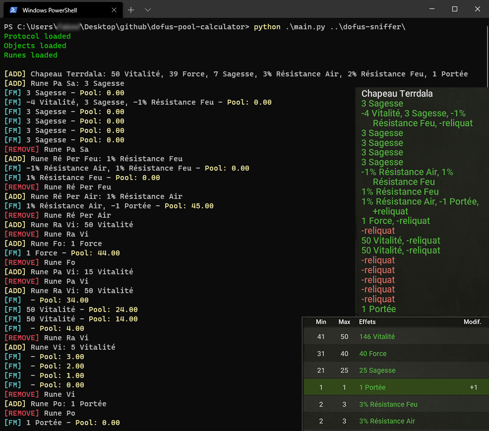

# Dofus Pool Calculator (Calculateur de puit)



## Table of Contents

* [About the Project](#about-the-project)
  * [Built With](#built-with)
* [Getting Started](#getting-started)
  * [Prerequisites](#prerequisites)
  * [Installation](#installation)
* [Usage](#usage)
* [Roadmap](#roadmap)
* [Contributing](#contributing)
* [License](#license)
* [Contact](#contact)

## About The Project

A simple tool made in Python allows you to see the remaining pool when you fm.  
Tested and working on ***Windows 10*** and ***Ubuntu 20.04***  
**PROJECT STILL IN PROGRESS**

### Built With

* [Python 3.7](https://www.python.org/)
> For python versions newer than 3.7, make sure your version is compatible with the version of Scapy used in the sniffer

## Getting Started

To get a local copy up and running follow these simple steps.

### Prerequisites

* Python 3.7 for **WINDOWS**  
https://www.python.org/downloads/release/python-379/
* Python 3.7 for **DEBIAN distributions**
```sh
sudo apt install python3.7
```
* Dofus Sniffer
```sh
git clone https://github.com/AxelConceicao/dofus-sniffer.git
```
> Please see instructions to make the sniffer functional: https://github.com/AxelConceicao/dofus-sniffer/blob/main/README.md

### Installation

1. Clone the repo
```sh
git clone https://github.com/AxelConceicao/dofus-pool-calculator.git
```

## Usage

```
$ python main.py -h
usage: main.py [-h] [-d] sniffer

positional arguments:
  sniffer      path to the sniffer directory

optional arguments:
  -h, --help   show this help message and exit
  -d, --debug  show debug logs
```

## Roadmap

See the [open issues](https://github.com/AxelConceicao/dofus-pool-calculator/issues) for a list of proposed features (and known issues).

## Contributing

Contributions are what make the open source community such an amazing place to be learn, inspire, and create. Any contributions you make are **greatly appreciated**.

1. Fork the Project
2. Create your Feature Branch (`git checkout -b feature/AmazingFeature`)
3. Commit your Changes (`git commit -m 'Add some AmazingFeature'`)
4. Push to the Branch (`git push origin feature/AmazingFeature`)
5. Open a Pull Request

## License

Distributed under the MIT License. See `LICENSE` for more information.

## Contact

Project Link: [https://github.com/AxelConceicao/dofus-pool-calculator](https://github.com/AxelConceicao/dofus-pool-calculator)
